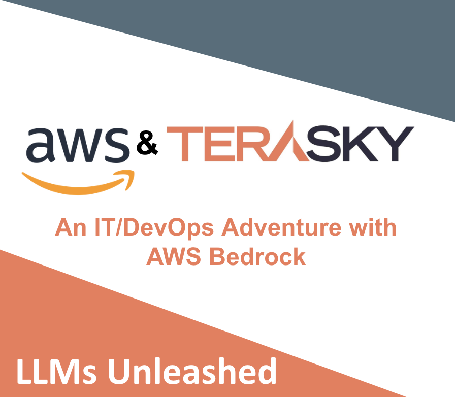

  

# AWS Bedrock LLM Workshop

This workshop is designed to guide you through various aspects of working with AWS Bedrock and LLMs. Below is a summary of each lab included in this repository.

## Labs Overview

1. **Installing AWS Bedrock and SageMaker Notebook instance**
   - A step-by-step guide to installing and configuring AWS Bedrock for your environment.
   - [Read more](./install.md)

2. **Introduction to Prompt Engineering**
   - Explore the fundamentals of prompt engineering and how to create effective prompts for LLMs.
   - [Read more](./prompt_intro.md)

3. **Creating Guardrails for LLMs**
   - Learn how to implement guardrails to ensure the safe and controlled operation of LLMs.
   - [Read more](./guardrails.md)

4. **Monitoring with CloudWatch**
   - Instructions on setting up CloudWatch to monitor the performance and behavior of your LLMs.
   - [Read more](./cloudwatch.md)

5. **Building an IT Support Agent**
   - Learn how to create an IT support agent using AWS Bedrock and LLMs.
   - [Read more](./it-agent.md)

6. **Knowledge Base Agent Integration**
   - A guide to integrating a knowledge base agent with AWS Bedrock to enhance LLM capabilities.
   - [Read more](./kb_agent.md)

---

Each lab is self-contained and can be followed independently. Start with the lab that best suits your learning needs.
