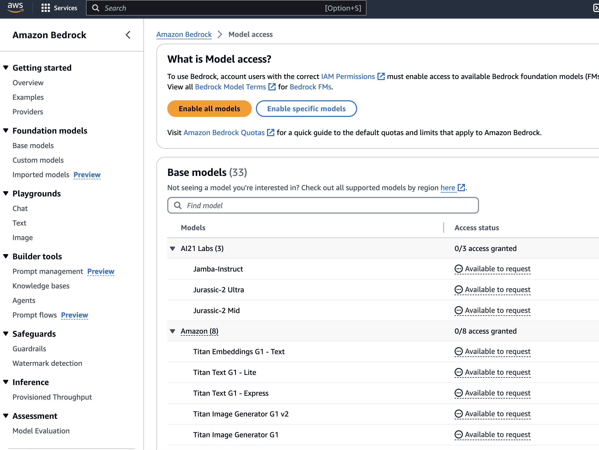
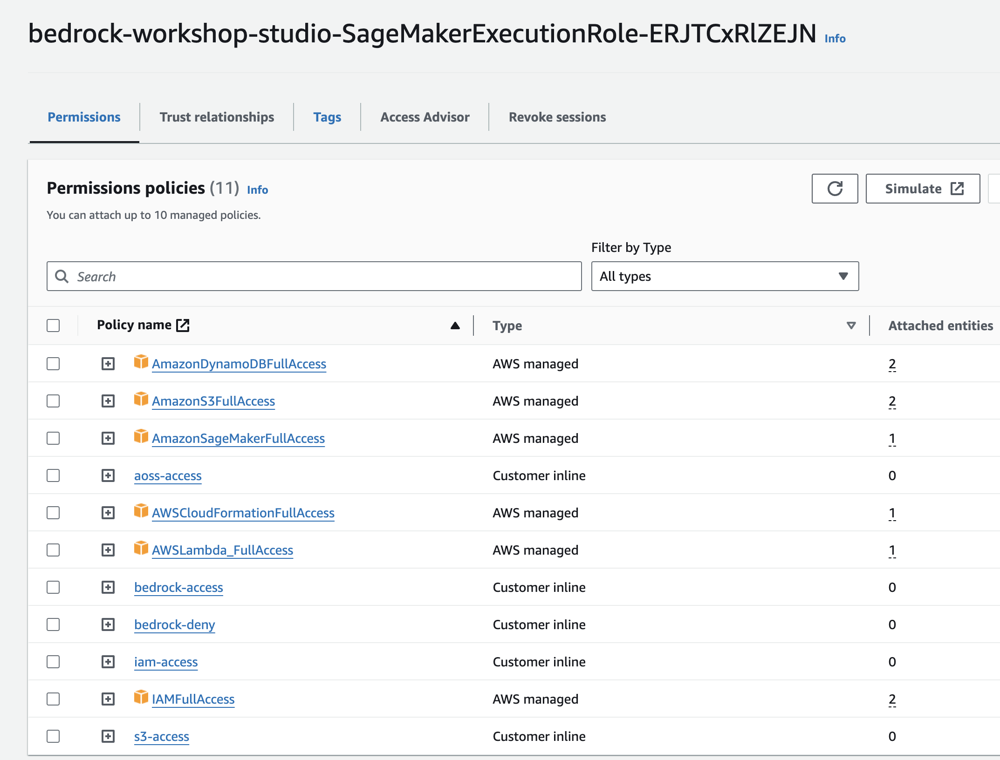
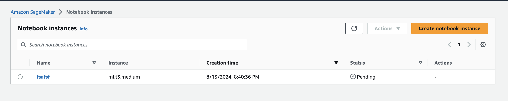
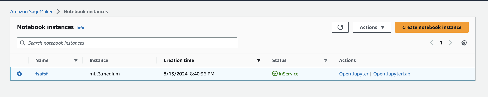
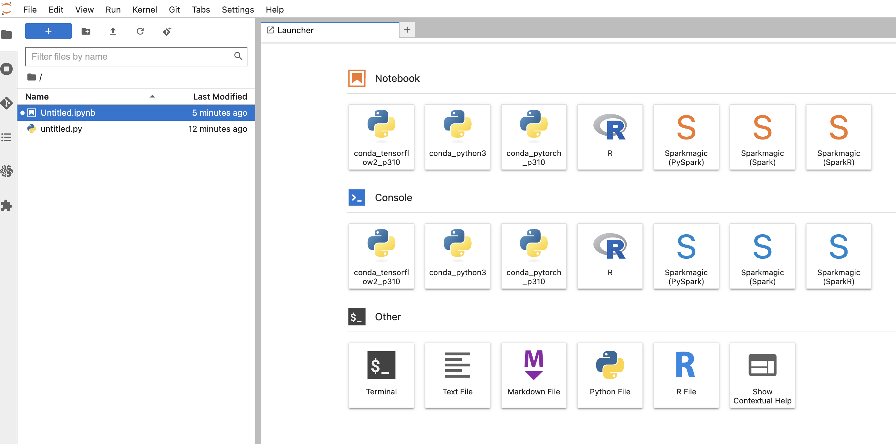
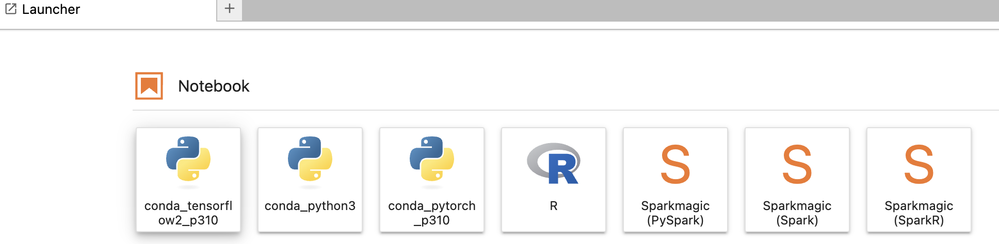
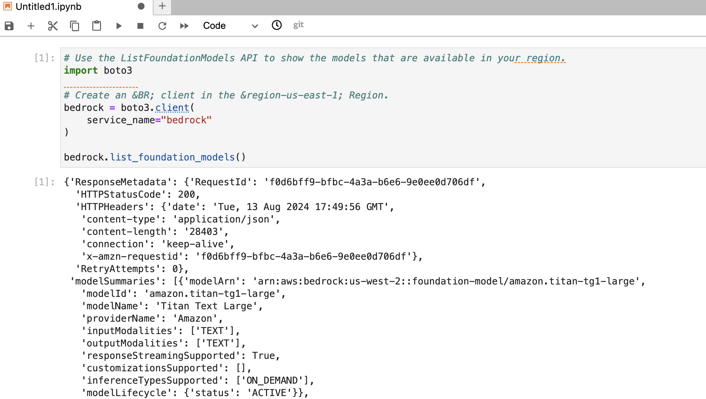
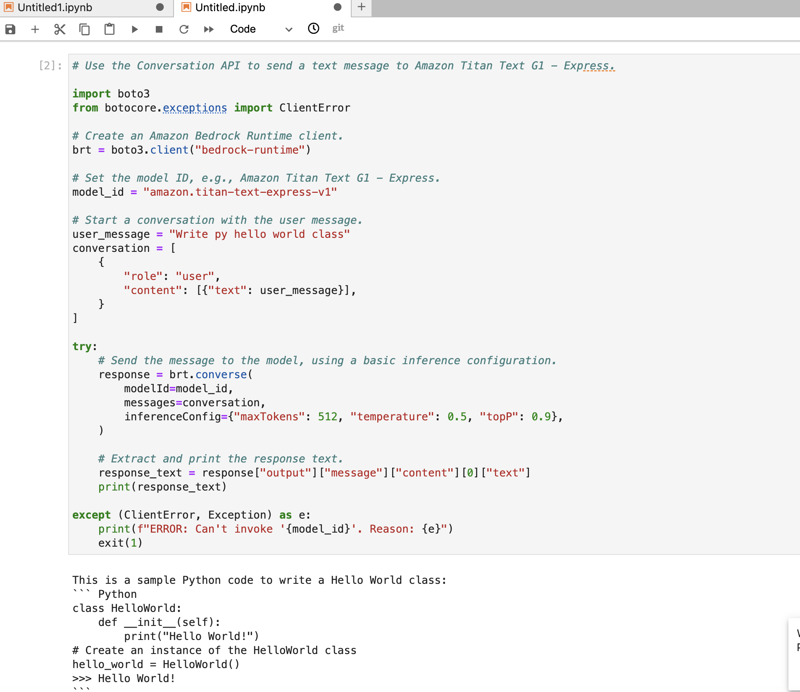

# Getting started with Amazon Bedrock

1. Sign into the AWS Management Console and switch to the Amazon Bedrock role that you set up (or that was set up for you) by following the steps under **To switch to a role (console)** in [Switching to a role (console)](https://docs.aws.amazon.com/IAM/latest/UserGuide/id_roles_use_switch-role-console.html).

2. Open the Amazon Bedrock console at [https://console.aws.amazon.com/bedrock/](https://console.aws.amazon.com/bedrock/).

3. For the purposes of this tutorial, you should be in the US East (N. Virginia) (us-east-1) Region. To change regions, choose the Region name at the top right of the console, next to your IAM role. Then select US East (N. Virginia) (us-east-1).

4. Select **Model access** at the bottom of the left navigation pane.


5. On the **Model access** page, you can review the End User License Agreement (EULA) for models in the **EULA** column in the **Base models** table.

6. Choose **Modify model access**.

7. Do one of the following:
   - To request access to all models, choose **Enable all models**. On the page you're taken to, the checkboxes next to all the models will be filled.
   - To request access to specific models, choose **Enable specific models**. On the page you're taken to, you have the following options:
     - To request access to all models by a provider, select the checkbox next to the provider name.
     - To request access to one model, select the checkbox next to the model name.

8. For our lab just request access to all models  **Next**.

   


9. Review the models that you're requesting access to and the **Terms**. When you're ready, choose **Submit** to request access.

10. Access may take several minutes to complete. When access is granted to a model, the **Access status** for that model will become **Access granted** , you may get some license aggrement issues on some of the models that cannot be activated in the lab env and you can safely ignore it.


## Create a SageMaker notebook instance


An Amazon SageMaker notebook instance is a fully-managed machine learning (ML) Amazon Elastic Compute Cloud (Amazon EC2) compute instance. An Amazon SageMaker notebook instance runs the Jupyter Notebook application. Use the notebook instance to create and manage Jupyter notebooks for preprocessing data, train ML models, and deploy ML models.


1. Open the Amazon SageMaker console at [https://console.aws.amazon.com/sagemaker/](https://console.aws.amazon.com/sagemaker/).

2. Choose **Notebook instances**, and then choose **Create notebook instance**.

3. On the **Create notebook instance** page, provide the following information (if a field is not mentioned, leave the default values):
   
   1. For **Notebook instance name**, type a name for your notebook instance.
   
   2. For **Notebook Instance type**, choose `ml.t2.medium`. This is the least expensive instance type that notebook instances support, and is enough for this exercise. If a `ml.t2.medium` instance type isn't available in your current AWS Region, choose `ml.t3.medium`.
   
   3. For **Platform Identifier**, choose a platform type to create the notebook instance on. This platform type defines the Operating System and the JupyterLab version that your notebook instance is created with. For information about platform identifier type, see [Amazon Linux 2 notebook instances](./nbi-al2.html). For information about JupyterLab versions, see [JupyterLab versioning](./nbi-jl.html).
   
   4. For **IAM role**, choose **Select existing role**, and then choose **arn:aws:iam::xxxxxxxx:role/bedrock-workshop-studio-SageMakerExecutionRole-yyyyyy **. This IAM role automatically gets permissions to access all resources needed for our labs.

   

   
   5. Choose **Create notebook instance**.
   
      In a **few minutes**, SageMaker launches a notebook instance and attaches a 5 GB Amazon EBS storage volume to it. The notebook instance has a preconfigured Jupyter notebook server, SageMaker and AWS SDK libraries, and a set of Anaconda libraries.
      
      For more information about creating a SageMaker notebook instance, see [Create a Notebook Instance](https://docs.aws.amazon.com/sagemaker/latest/dg/howitworks-create-ws.html).

   


   6. When the Status of the notebook instance is **InService**, choose the instance and then choose **Open JupyterLab**.

   


## Install lab setup 


1. In the notebook Launcher select terminal 

   

2. Run git clone

```python
git clone https://github.com/aws-samples/amazon-bedrock-workshop
```

3. Install the boto3 and botocore AWS SDK for Python (Boto3) libraries.

```python
pip install --no-build-isolation --force-reinstall \
    "boto3>=1.28.57" \
    "awscli>=1.29.57" \
    "botocore>=1.31.57"
```

4. in the Lancher meno click on NoteBook -> conda_python3

   


5. Copy the code snippets bellow and execute the notebook


## List the foundation models that Amazon Bedrock has to offer


The following example runs the [ListFoundationModels](https://docs.aws.amazon.com/bedrock/latest/APIReference/API_ListFoundationModels.html) operation using an Amazon Bedrock client. `ListFoundationModels` lists the foundation models (FMs) that are available in Amazon Bedrock in your region. Run the following SDK for Python script to create an Amazon Bedrock client and test the [ListFoundationModels](https://docs.aws.amazon.com/bedrock/latest/APIReference/API_ListFoundationModels.html) operation:

```python
# Use the ListFoundationModels API to show the models that are available in your region.
import boto3
             
# Create an &BR; client in the &region-us-east-1; Region.
bedrock = boto3.client(
    service_name="bedrock"
)

bedrock.list_foundation_models()
```

Output should be something like



## Submit a text prompt to a model and generate a response


The following example runs the [Converse](https://docs.aws.amazon.com/bedrock/latest/APIReference/API_runtime_Converse.html) operation using an Amazon Bedrock client. `Converse` lets you submit a prompt to generate a model response. Run the following SDK for Python script to create an Amazon Bedrock runtime client and test the [Converse](https://docs.aws.amazon.com/bedrock/latest/APIReference/API_runtime_Converse.html) operation:

```python
# Use the Conversation API to send a text message to Amazon Titan Text G1 - Express.

import boto3
from botocore.exceptions import ClientError

# Create an Amazon Bedrock Runtime client.
brt = boto3.client("bedrock-runtime")

# Set the model ID, e.g., Amazon Titan Text G1 - Express.
model_id = "amazon.titan-text-express-v1"

# Start a conversation with the user message.
user_message = "Describe the purpose of a 'hello world' program in one line."
conversation = [
    {
        "role": "user",
        "content": [{"text": user_message}],
    }
]

try:
    # Send the message to the model, using a basic inference configuration.
    response = brt.converse(
        modelId=model_id,
        messages=conversation,
        inferenceConfig={"maxTokens": 512, "temperature": 0.5, "topP": 0.9},
    )

    # Extract and print the response text.
    response_text = response["output"]["message"]["content"][0]["text"]
    print(response_text)

except (ClientError, Exception) as e:
    print(f"ERROR: Can't invoke '{model_id}'. Reason: {e}")
    exit(1)
```

Output should be something like

